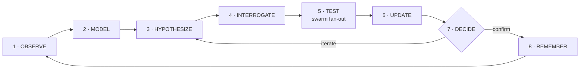

<div align="center">

# 🐉 CHIMERA

**A closed-loop causal reasoning engine for offensive security.**
*It does not match signatures. It falsifies assumptions.*


**Your scanner has a signature list. Chimera has a scientific method.**

</div>

---

> Chimera models what your software *claims* to do, diffs it against what your
> code *actually* does, and then attacks the difference — with falsifiable
> hypotheses, controlled experiments, calibrated belief updates, and a
> cryptographic chain of custody on every single claim.

---

## ⚡ Why Chimera Exists

Signature scanners memorize the past. Fuzzers stumble through the dark.
Chimera instead behaves like a hostile scientist:

1. **Observe** the target through a cascade of deep parsers.
2. **Model** declared intent vs. real implementation as graphs.
3. **Hypothesize** falsifiable claims about violated security assumptions.
4. **Interrogate** every claim with a hostile Debunker.
5. **Test** via a bounded autonomous swarm of execution agents.
6. **Update** beliefs with Brier-calibrated epistemic scoring.
7. **Decide** — confirm, refute, or iterate.
8. **Remember** everything in a decaying hybrid memory moat.



---

## 🧬 The Three Doctrines

| Doctrine | Meaning |
|---|---|
| **The Debunker is the Gatekeeper** | No hypothesis survives without enduring a hostile adversary. 9+ implemented attack vectors act as falsification instruments. |
| **Memory is the Moat** | ChromaDB vector embeddings + BM25-style sparse retrieval + temporal decay. Every target analyzed makes the next analysis sharper. |
| **Evidence is the Currency** | AST nodes, HTTP traces, runtime observations — every artifact carries an immutable, SHA-256-fingerprinted chain of custody. Unverifiable claims do not exist. |

---

## 🎯 What It Hunts

- **IDOR** — insecure direct object references via data-flow differentials
- **Horizontal / Vertical Privilege Escalation**
- **Injection** — grammar differentials (string-built SQL vs parameterized queries)
- **Workflow Bypasses** — state-machine extraction and illegal transitions
- **Race Conditions** — including async TOCTOU across await boundaries
- **State Machine Violations**
- **Intent-vs-Implementation Contradictions** — GraphQL `@auth` declared, resolver check absent

---

## 🧠 Architecture, In One Breath

Deep parser cascade (Python AST · SQL DDL · GraphQL intent · JS async-state)
feeds a **causal differential engine** that converts intent/implementation
contradictions into hypotheses. A **swarm execution plane** — terminal layer,
headless browser layer, and persistent tool sensors like **Caido** — runs
bounded falsification experiments, and a **hybrid epistemic memory** decays
stale beliefs so long autonomous operations stay calibrated.

📐 Full diagrams: [`docs/ARCHITECTURE.md`](docs/ARCHITECTURE.md) ·
🐝 Swarm design: [`docs/SWARM_ARCHITECTURE.md`](docs/SWARM_ARCHITECTURE.md)

---

## 🧩 Plugin Ecosystem

Chimera treats external tools as **epistemic sensors**, not products:

- **CaidoBridge** — persistent GraphQL sensor for HTTP observation & replay
- **SARIFExporter** — chain-of-custody-preserving SARIF 2.1.0 findings export
- **ToolPlugin ABC** — bring your own sensor in ~30 lines

---

## 🚀 Quickstart

```bash
git clone https://github.com/emmanuelAdesina/chimera
cd chimera
python -m pip install -e .          # core runs on the standard library alone
python -m pytest tests/             # 124 tests
```

Run your first analysis (no installs, no services needed):

```bash
python -m chimera analyze tests/targets/vuln_orders_app.py
python -m chimera analyze ./your_service --json report.json
python -m chimera analyze ./app --threshold 0.65 --budget 20
python -m chimera analyze ./app --fail-on-findings   # exit 1 on confirmed vulns (CI gating)
```

What the loop does on a static target:
**parse → intent → implementation → differentials → hypotheses (born with
evidence + falsifiers) → hostile debunking (9 vectors) → epistemic calibration
→ static verification probes (the loop closes) → report.**

Optional planes install as extras: `pip install -e ".[vector]"` (ChromaDB
semantic memory), `".[http]"` (Caido bridge), `".[browser]"` (Playwright
layer). Every one degrades gracefully when absent.

Dispatch your first swarm:

```python
import asyncio
from chimera.execution.swarm_bootstrap import build_default_swarm
from chimera.execution.swarm_coordinator import SwarmTask

async def main():
    swarm = await build_default_swarm(
        workspace_root=".",
        allowed_hosts=["localhost"],   # explicit authorization scope
    )
    results = await swarm.dispatch_swarm([
        SwarmTask(capability="terminal.execute",
                  payload={"argv": ["python", "--version"], "cwd": "."}),
    ])
    print([r.status for r in results])
    await swarm.stop()

asyncio.run(main())
```

---

## 🗂️ Repository Map

```
chimera/
├─ core/        # orchestrator, causal engine, epistemic monitor, memory
├─ models/      # Hypothesis, Evidence, chain-of-custody contracts
├─ parsers/     # python AST · SQL DDL · GraphQL intent · JS async-state
├─ execution/   # SwarmCoordinator, capability registry, bootstrap
├─ layers/      # policy-sandboxed terminal · headless browser
├─ plugins/     # CaidoBridge · SARIFExporter · ToolPlugin ABC
└─ tests/       # reasoning-loop integration tests
```

---

## 🛣️ Roadmap

- [ ] Distributed swarm substrate (Redis Streams / NATS / Ray)
- [ ] VEX export alongside SARIF
- [ ] Mutation-testing CI (mutmut) + strict mypy gate
- [ ] Additional parser cascades (Solidity, gRPC/protobuf)
- [ ] Cross-operation federated memory with differential privacy

---

## ⚖️ Responsible Use

Chimera is a **security research and authorized-testing instrument**.
Deploy it only against systems you own or are explicitly contracted to test.
Every execution layer enforces explicit scope allowlists; capability without
authorization is outside the design envelope.

---

<div align="center">

**If Chimera sharpened your reasoning, leave a ⭐ — the moat grows with every analyst.**

</div>
