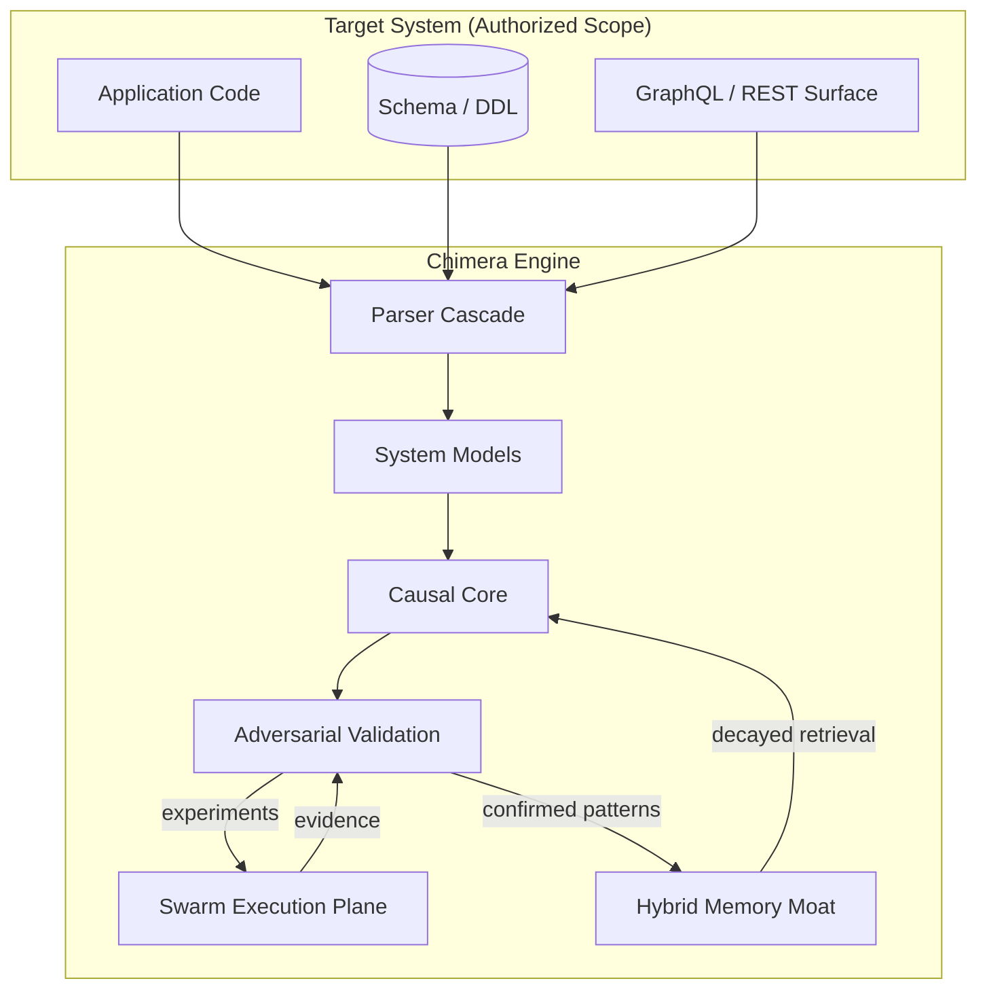
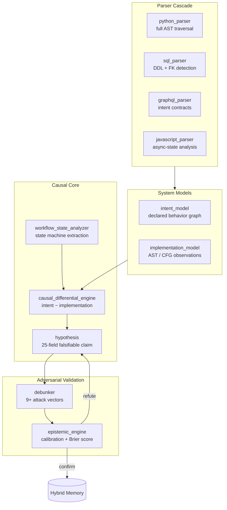
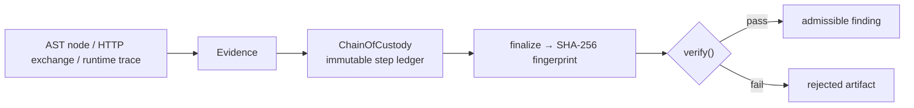
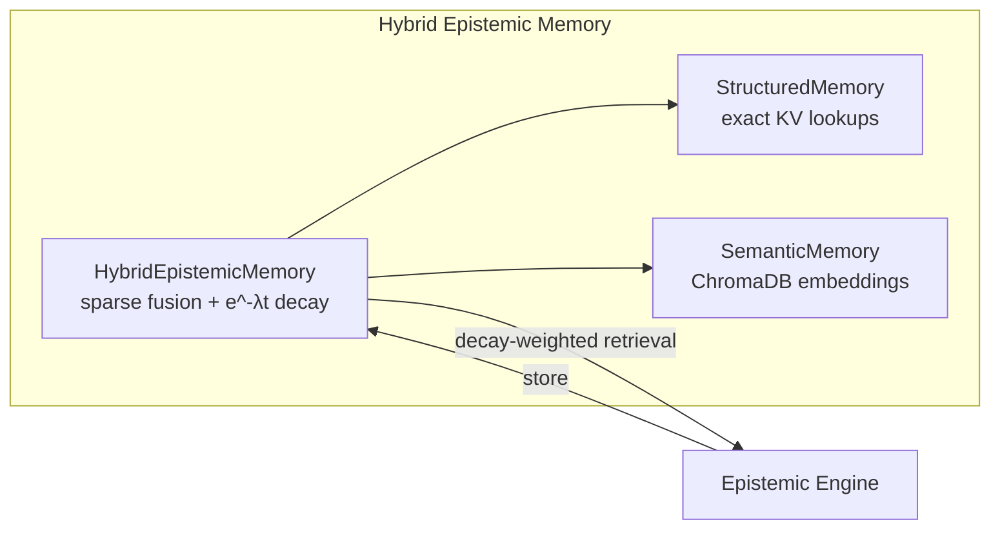

# CHIMERA — Reasoning & Attack Architecture

> How Chimera observes, reasons, attacks, and remembers.

## 1. System Context



## 2. The Reasoning Loop

| Phase | Actor | Output |
|---|---|---|
| 1 Observe | parsers | raw AST / DDL / schema artifacts |
| 2 Model | intent & implementation models | typed semantic graphs |
| 3 Hypothesize | causal differential engine | falsifiable claims |
| 4 Interrogate | debunker | counter-hypotheses, attack plans |
| 5 Test | swarm execution plane | controlled experiments |
| 6 Update | epistemic engine | Brier-calibrated confidence |
| 7 Decide | orchestrator | confirm / refute / iterate |
| 8 Remember | hybrid memory | decayed, retrievable patterns |

## 3. Attack Pipeline — Intent vs Implementation

Chimera's offensive power comes from attacking the **delta** between what a
system declares and what it implements.



### 3.1 Example Contradiction

```
SCHEMA (intent):      type Query { user(id: ID!): User @auth }
RESOLVER (impl):      def resolve_user(...): return db.get(id)   # no check
DIFFERENTIAL:         auth declared ∧ auth absent  ⇒  hypothesis
FALSIFICATION:        swarm replays unauthenticated request ⇒ evidence
```

## 4. Evidence & Chain of Custody

No claim is admissible without provenance.



## 5. Memory Is The Moat



Temporal decay `score × e^(−λ·age)` prevents attention drift during long
autonomous operations: stale hypotheses lose influence; fresh, calibrated
evidence dominates.

## 6. File Map

| File | Responsibility |
|---|---|
| `core/orchestrator.py` | 8-phase loop control |
| `core/workflow_state_analyzer.py` | state machine extraction |
| `core/causal_differential_engine.py` | differentials → hypotheses |
| `core/debunker.py` | hostile falsification vectors |
| `core/epistemic_engine.py` | calibration, counter-hypotheses |
| `core/memory.py` | structured + semantic memory |
| `parsers/*` | language cascades |
| `execution/swarm_coordinator.py` | tactical dispatch |
| `plugins/*` | epistemic sensors & exporters |
