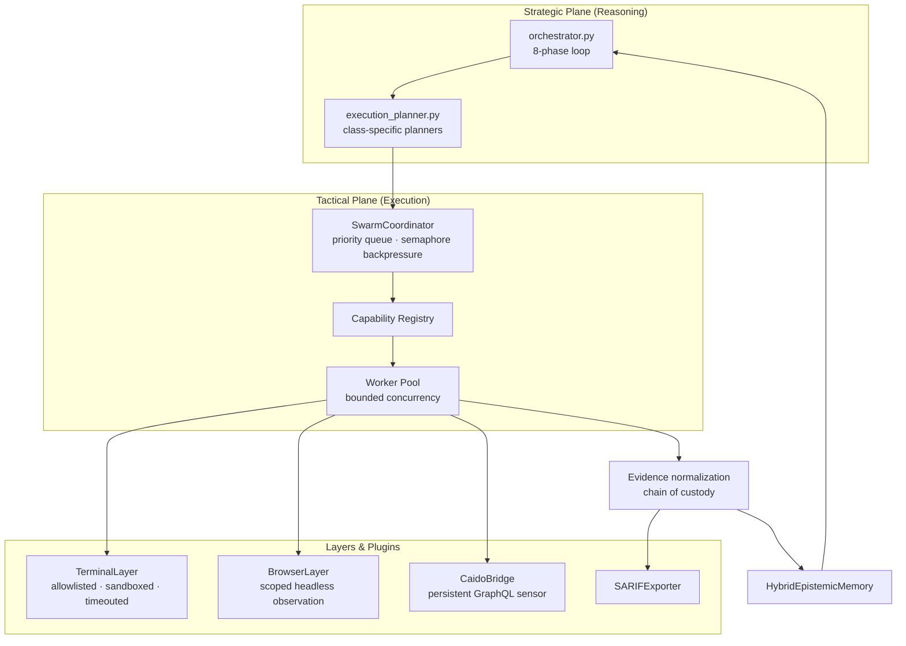
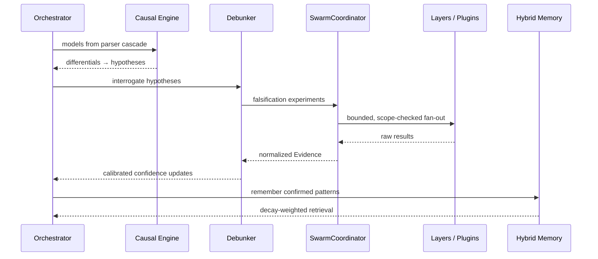
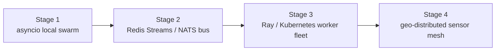

# CHIMERA — Autonomous Swarm Architecture

> Strategic reasoning stays in the v2 orchestrator.
> Tactical execution is fanned out to a bounded, scoped swarm.

## 1. Plane Separation



## 2. Operation Lifecycle



## 3. Coordinator Internals

- **SwarmTask** — capability name + payload + explicit authorization scope.
- **Priority queue** — strategic planner biases critical falsifications first.
- **Semaphore backpressure** — concurrency bounded; queue overflow rejected, never silent.
- **Capability registry** — sync or async callables; outputs normalized to `Evidence`.
- **SwarmResult** — status, error, timing, evidence list per task.

## 4. Safety Envelope

| Control | Layer |
|---|---|
| Executable allowlist, no `shell=True` | TerminalLayer |
| Workspace-root confinement | TerminalLayer |
| Hard timeouts + output caps | TerminalLayer |
| Host allowlist scoping | BrowserLayer / CaidoBridge |
| Active-scan opt-in flag | CaidoBridge |
| Chain-of-custody fingerprinting | Evidence model |

## 5. Scaling Ladder



The coordinator's queue is the only coupling point: swapping `asyncio.Queue`
for a distributed stream upgrades the swarm without touching the reasoning
core.

## 6. Registering A New Sensor

```python
swarm.register_agent_capability("nuclei.observe", my_adapter.execute)
```

Any object exposing `execute(payload) -> Evidence | list[Evidence]` becomes a
first-class swarm capability. Tools are sensors; evidence is the currency.
